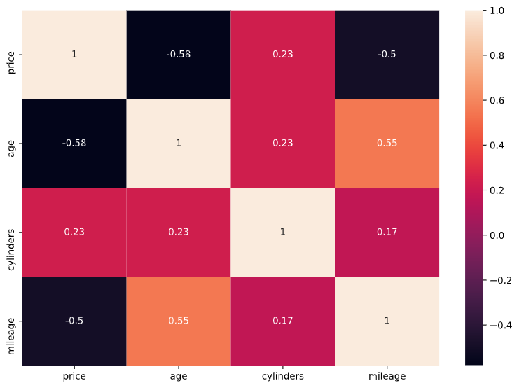
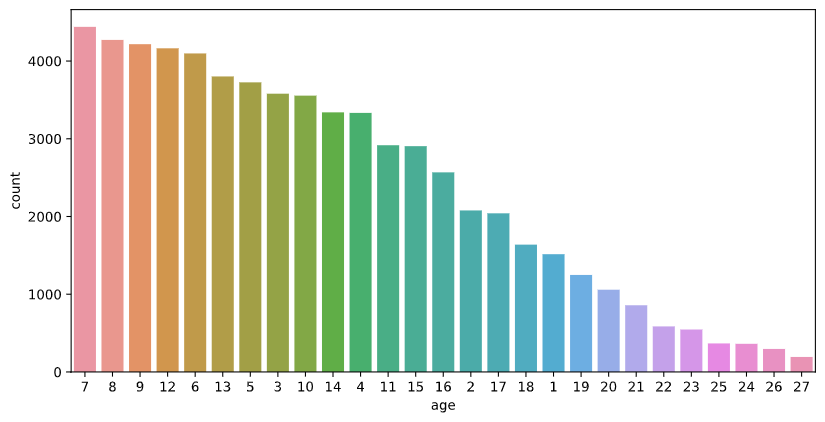
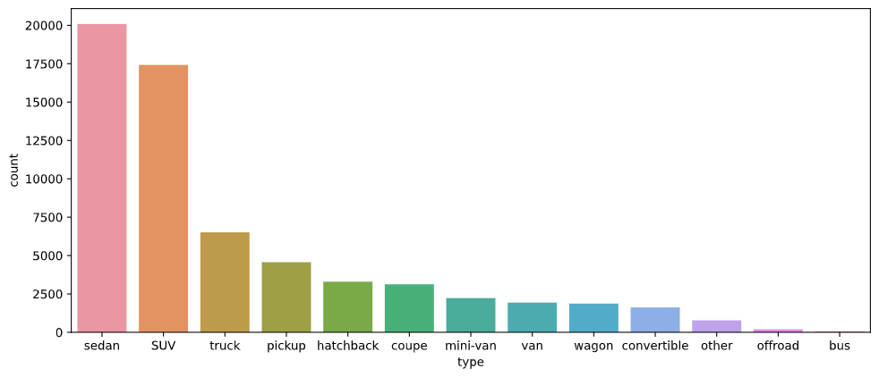
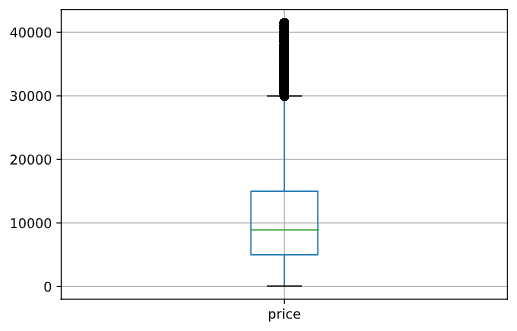

# Car-price-Prediction

Analyzed the data of 550k rows and 22 features from Craiglist.org(Kaggle) to predict the price.

Used Python for Data Cleaning, Feature Engineering, Feature selection, and Data analysis.

Implemented different algorithms like Linear Regression, Gradient boosting, Ridge regression, and Random Forest and attained the R² score of 0.849 with Random Forest.

## Graphs

